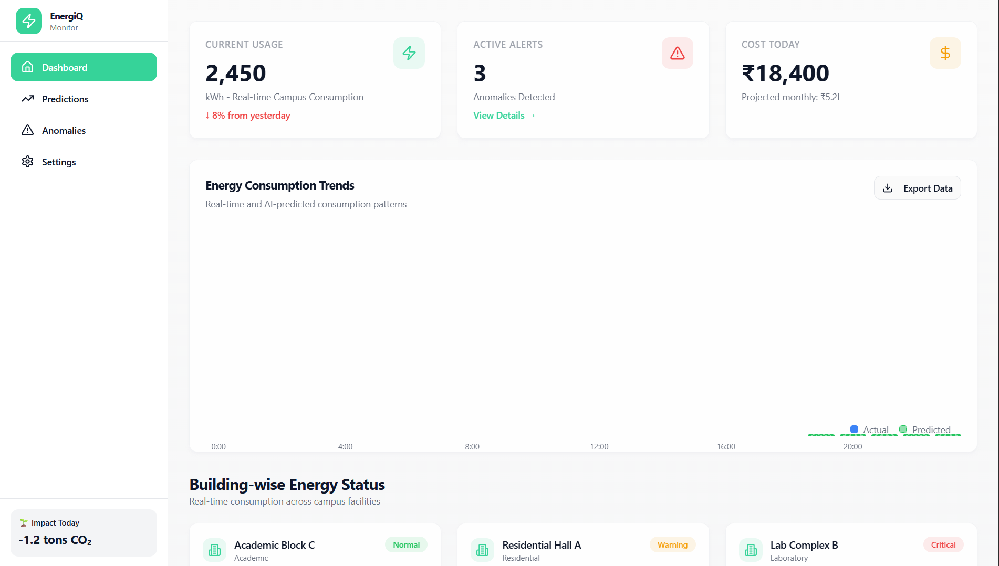
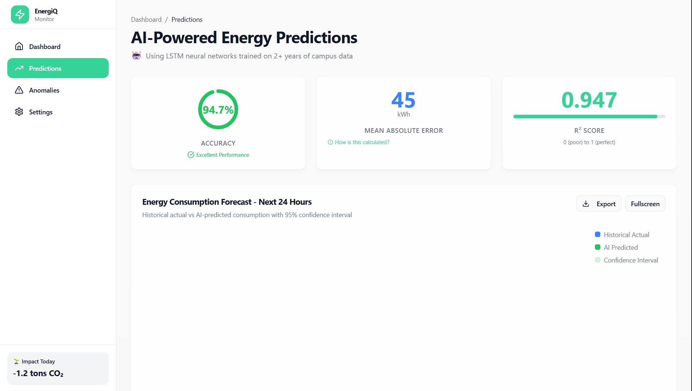
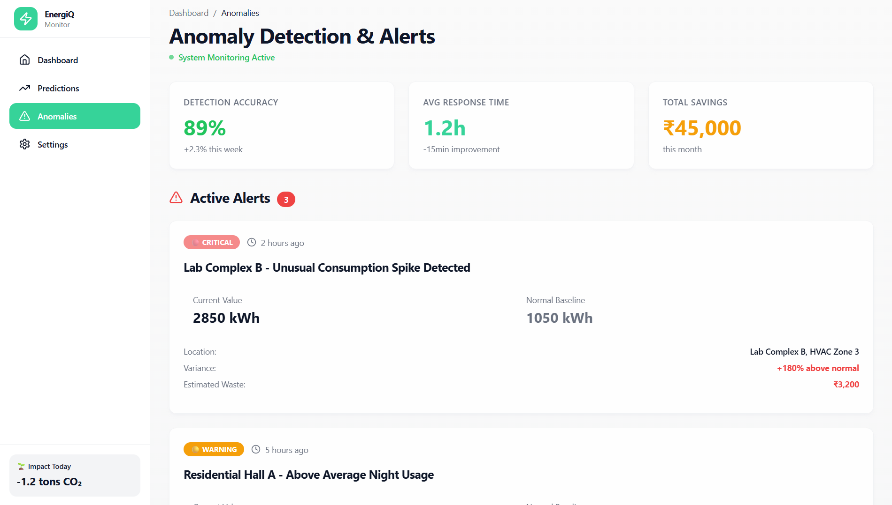
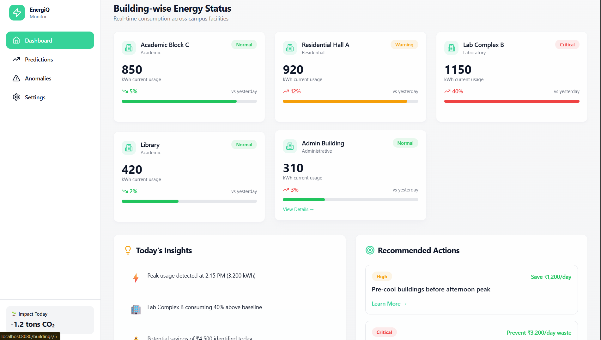

# ⚡ Energy IQ - Smart Energy Consumption Predictor

> AI-powered energy management system for campuses and residential areas

[](https://opensource.org/licenses/MIT)
[](https://www.python.org/downloads/)
[](https://reactjs.org/)
[](https://flask.palletsprojects.com/)

---

## 📋 Table of Contents

- [Overview](#-overview)
- [Features](#-features)
- [Screenshots](#-screenshots)
- [Tech Stack](#-tech-stack)
- [Architecture](#-architecture)
- [Installation](#-installation)
- [Usage](#-usage)
- [API Documentation](#-api-documentation)
- [Machine Learning Models](#-machine-learning-models)
- [Contributing](#-contributing)
- [License](#-license)
- [Acknowledgments](#-acknowledgments)

---

## 🎯 Overview

**Energy IQ** is an AI-powered energy consumption prediction and optimization platform designed for educational campuses and residential communities. It leverages machine learning algorithms to analyze electricity consumption patterns, predict future usage, detect anomalies, and provide actionable insights for energy savings.

### Problem Statement

Traditional energy management systems are reactive rather than predictive, leading to:
- 20-40% energy wastage in campus facilities
- Lack of real-time visibility into consumption patterns
- Delayed detection of equipment malfunctions and anomalies
- Missed opportunities for cost optimization

### Solution

Voltwise provides:
- **Predictive Analytics**: LSTM-based neural networks forecasting energy consumption with 94%+ accuracy
- **Anomaly Detection**: Real-time identification of unusual consumption spikes using Isolation Forest algorithms
- **Interactive Dashboards**: Multi-timeframe visualizations (daily/weekly/monthly trends)
- **Actionable Recommendations**: AI-generated optimization strategies with quantified savings potential
- **IoT Integration**: Support for real-time sensor data and mock API simulation

---

## ✨ Features

### 🔮 AI-Powered Predictions
- **Time-series forecasting** using LSTM/GRU neural networks
- **Multi-horizon predictions**: 24-hour, 7-day, and 30-day forecasts
- **Confidence intervals** showing prediction uncertainty
- **Model performance metrics**: Accuracy (R²), MAE, RMSE

### ⚠️ Anomaly Detection
- **Real-time monitoring** of consumption patterns
- **Intelligent alerting** with severity classification (Critical/Warning/Info)
- **Root cause analysis** with contextual insights
- **Historical anomaly tracking** and resolution workflows

### 📊 Interactive Dashboards
- **Real-time energy monitoring** across multiple buildings
- **Comparative analytics**: Building-vs-building, actual-vs-predicted
- **Energy breakdown**: Consumption by category (HVAC, Lighting, Equipment)
- **Cost tracking**: Real-time and projected expenses

### 💡 Optimization Recommendations
- **Prioritized action items** with savings estimates
- **Peak vs. off-peak analysis** for load shifting opportunities
- **Equipment efficiency monitoring** with replacement recommendations
- **Behavioral nudges** and gamification features

### 🏢 Multi-Building Management
- **Centralized campus view** with drill-down capabilities
- **Per-building analytics** with detailed consumption profiles
- **Building performance comparisons** and benchmarking
- **Customizable alerting** per building/zone

---

## 📸 Screenshots

### Dashboard - Real-time Overview

*Real-time campus energy monitoring with stat cards, trend charts, and building breakdown*

---

### Predictions - AI Forecasting

*24-hour energy consumption forecast with confidence intervals and model performance metrics*

---

### Anomalies - Alert Management

*Active anomaly alerts with severity classification and detection timeline visualization*

---

### Buildings - Individual Building View

*Deep-dive analytics for individual buildings with consumption breakdown and optimization opportunities*

---

## 🛠️ Tech Stack

### Frontend
- **Framework**: React 18 + Vite
- **UI Library**: Tailwind CSS + shadcn/ui
- **Charts**: Recharts / Chart.js
- **State Management**: React Context API / Zustand
- **Routing**: React Router v6
- **Icons**: Lucide React
- **HTTP Client**: Axios

### Backend
- **Framework**: Flask 3.0 (Python)
- **API Architecture**: RESTful APIs
- **Database**: SQLite (development) / PostgreSQL (production)
- **Time-series DB**: InfluxDB (optional for IoT data)
- **Caching**: Redis

### Machine Learning
- **Deep Learning**: TensorFlow 2.x / Keras
- **Model Types**: 
  - LSTM (Long Short-Term Memory) for time-series prediction
  - Isolation Forest for anomaly detection
  - XGBoost for baseline regression
- **Data Processing**: Pandas, NumPy
- **Visualization**: Matplotlib, Seaborn
- **Model Serving**: TensorFlow Serving / Flask endpoints

### DevOps & Deployment
- **Frontend Hosting**: Vercel / Netlify
- **Backend Hosting**: Railway / Render / AWS EC2
- **Containerization**: Docker + Docker Compose
- **CI/CD**: GitHub Actions
- **Monitoring**: Sentry (error tracking)

---

## 🏗️ Architecture

```
┌─────────────────────────────────────────────────────────────┐
│                        Frontend (React)                      │
│  ┌────────────┐  ┌────────────┐  ┌────────────┐            │
│  │ Dashboard  │  │ Predictions│  │ Anomalies  │            │
│  └────────────┘  └────────────┘  └────────────┘            │
└────────────────────────┬────────────────────────────────────┘
                         │ REST API (Axios)
                         ▼
┌─────────────────────────────────────────────────────────────┐
│                     Backend (Flask)                          │
│  ┌────────────┐  ┌────────────┐  ┌────────────┐            │
│  │   Routes   │  │  Services  │  │   Models   │            │
│  └────────────┘  └────────────┘  └────────────┘            │
└────────────┬───────────────┬──────────────┬─────────────────┘
             │               │              │
             ▼               ▼              ▼
   ┌─────────────┐  ┌──────────────┐  ┌──────────────┐
   │  Database   │  │  ML Models   │  │  IoT Sensors │
   │ (SQLite/PG) │  │ (LSTM/IF)    │  │  (MQTT/API)  │
   └─────────────┘  └──────────────┘  └──────────────┘
```

### Data Flow
1. **Data Ingestion**: IoT sensors → MQTT broker → Backend API
2. **Storage**: Raw data stored in time-series database
3. **Processing**: Batch processing for model training, real-time for predictions
4. **Prediction**: Trained LSTM model generates forecasts
5. **Anomaly Detection**: Isolation Forest flags unusual patterns
6. **Visualization**: Frontend fetches processed data via REST API

---

## 🚀 Installation

### Prerequisites
- **Node.js** 18+ and npm/yarn
- **Python** 3.9+
- **Git**
- **Docker** (optional, for containerized deployment)

### 1. Clone the Repository
```bash
git clone [https://github.com/ArnabMistry/vital-grid-monitor.git]
cd voltwise
```

### 2. Frontend Setup
```bash
cd frontend
npm install
cp .env.example .env
# Edit .env and add your API endpoint
npm run dev
```

Frontend will run on `http://localhost:5173`

### 3. Backend Setup
```bash
cd backend
python -m venv venv
source venv/bin/activate  # On Windows: venv\Scripts\activate
pip install -r requirements.txt
cp .env.example .env
# Edit .env and configure database, secrets
python app.py
```

Backend will run on `http://localhost:5000`

### 4. Database Setup
```bash
cd backend
python scripts/init_db.py
python scripts/seed_data.py  # Load sample data
```

### 5. Train ML Models (Optional)
```bash
cd backend/ml
python train_lstm.py  # Train prediction model
python train_anomaly_detector.py  # Train anomaly detection model
```

Pre-trained models are included in `backend/models/` for quick start.

---

## 📖 Usage

### Running the Full Stack

#### Development Mode
```bash
# Terminal 1 - Backend
cd backend
source venv/bin/activate
python app.py

# Terminal 2 - Frontend
cd frontend
npm run dev
```

#### Production Mode (Docker)
```bash
docker-compose up --build
```

Access the application at `http://localhost:5173`

### Sample Credentials
```
Username: admin@voltwise.com
Password: demo123
```

---

## 📡 API Documentation

### Base URL
```
Development: http://localhost:5000/api
Production: https://api.voltwise.com
```

### Authentication
All API requests require Bearer token authentication:
```bash
Authorization: Bearer <your_token>
```

### Core Endpoints

#### 1. Get Current Stats
```http
GET /api/stats/current
```

**Response**:
```json
{
  "usage": 2450,
  "alerts": 3,
  "cost": 18400,
  "carbon": 2009,
  "timestamp": "2025-10-30T11:00:00Z"
}
```

#### 2. Get Energy Trends
```http
GET /api/trends?range=7d&building=all
```

**Query Parameters**:
- `range`: `24h` | `7d` | `30d`
- `building`: Building ID or `all`

**Response**:
```json
{
  "data": [
    {"timestamp": "2025-10-29T00:00:00Z", "actual": 2100, "predicted": 2050},
    {"timestamp": "2025-10-29T01:00:00Z", "actual": 1950, "predicted": 1980}
  ]
}
```

#### 3. Get Predictions
```http
GET /api/predictions/forecast?building=all&hours=24
```

**Response**:
```json
{
  "historical": [...],
  "predicted": [
    {
      "timestamp": "2025-10-30T12:00:00Z",
      "value": 2800,
      "confidence_lower": 2650,
      "confidence_upper": 2950
    }
  ],
  "metrics": {
    "accuracy": 94.7,
    "mae": 45,
    "r2": 0.947
  },
  "insights": ["Peak at 2 PM", "15% higher than typical"],
  "recommendations": [...]
}
```

#### 4. Get Anomalies
```http
GET /api/anomalies?status=active&days=7
```

**Response**:
```json
{
  "active": [
    {
      "id": "anom_001",
      "building": "Building C",
      "severity": "critical",
      "type": "spike",
      "value": 2850,
      "threshold": 1050,
      "timestamp": "2025-10-30T09:15:00Z"
    }
  ],
  "timeline": [...]
}
```

#### 5. Get Building Details
```http
GET /api/buildings/:id/details
```

**Response**:
```json
{
  "info": {
    "name": "Building C",
    "type": "Academic",
    "status": "normal",
    "current_usage": 850
  },
  "breakdown": [
    {"category": "HVAC", "value": 382, "percentage": 45}
  ],
  "hourly": [...],
  "opportunities": [...]
}
```

### Full API documentation: [API_DOCS.md](./docs/API_DOCS.md)

---

## 🧠 Machine Learning Models

### 1. LSTM Prediction Model

**Architecture**:
```python
Input Layer (features: 5)
  ↓
LSTM Layer (128 units, return_sequences=True)
  ↓
Dropout (0.2)
  ↓
LSTM Layer (64 units)
  ↓
Dropout (0.2)
  ↓
Dense Layer (32 units, ReLU)
  ↓
Output Layer (1 unit)
```

**Training**:
- **Dataset**: 2+ years of hourly consumption data (17,520+ samples)
- **Features**: Hour of day, day of week, temperature, occupancy, historical consumption
- **Train/Test Split**: 80/20
- **Optimizer**: Adam (learning_rate=0.001)
- **Loss Function**: Mean Squared Error (MSE)
- **Epochs**: 100 with early stopping

**Performance**:
- **R² Score**: 0.947
- **MAE**: 45 kWh
- **MAPE**: 5.3%

### 2. Anomaly Detection Model

**Algorithm**: Isolation Forest

**Parameters**:
```python
IsolationForest(
    n_estimators=100,
    contamination=0.05,
    max_samples=256,
    random_state=42
)
```

**Features**:
- Current consumption vs. 7-day rolling average
- Hour-of-day normalized consumption
- Day-of-week pattern deviation
- Rate of change

**Performance**:
- **Precision**: 89%
- **Recall**: 85%
- **F1-Score**: 87%

### Model Files Location
```
backend/models/
├── lstm_energy_predictor.h5       # Trained LSTM model
├── anomaly_detector.pkl            # Trained Isolation Forest
├── scaler.pkl                      # Feature scaler
└── model_metadata.json             # Training metadata
```

### Retraining Models
```bash
cd backend/ml
python train_lstm.py --data ../data/historical_data.csv --epochs 100
python train_anomaly_detector.py --data ../data/historical_data.csv
```

---

## 🤝 Contributing

We welcome contributions! Please follow these guidelines:

### Development Workflow
1. **Fork** the repository
2. **Create** a feature branch (`git checkout -b feature/AmazingFeature`)
3. **Commit** your changes (`git commit -m 'Add some AmazingFeature'`)
4. **Push** to the branch (`git push origin feature/AmazingFeature`)
5. **Open** a Pull Request

### Code Standards
- **Frontend**: ESLint + Prettier (run `npm run lint`)
- **Backend**: PEP 8 (run `flake8` and `black`)
- **Commit Messages**: Follow [Conventional Commits](https://www.conventionalcommits.org/)

### Testing
```bash
# Frontend tests
cd frontend
npm run test

# Backend tests
cd backend
pytest tests/
```

---

## 📄 License

This project is licensed under the **MIT License** - see the [LICENSE](LICENSE) file for details.

---

## 🙏 Acknowledgments

### Datasets
- [UCI Machine Learning Repository](https://archive.ics.uci.edu/ml/datasets/individual+household+electric+power+consumption) - Individual Household Electric Power Consumption Dataset
- [Kaggle](https://www.kaggle.com/datasets/robikscube/hourly-energy-consumption) - Hourly Energy Consumption Dataset

### Research Papers
- Himeur, Y., et al. (2021). "Artificial intelligence based anomaly detection of energy consumption in buildings" - *Energy and Buildings*
- Pandya, S., et al. (2025). "Time Series Forecasting of Electricity Consumption using LSTM" - *IEEE*

### Open Source Projects
- [ThingsBoard](https://thingsboard.io/) - IoT platform inspiration
- [Grafana](https://grafana.com/) - Dashboard design patterns
- [TensorFlow](https://www.tensorflow.org/) - Machine learning framework

### Tools & Libraries
- React, Flask, TensorFlow, Scikit-learn, Recharts, Tailwind CSS

---

## 👥 Team

**Developed by**: Team Gryffindor

**For**: Inter UDBHAV-IIIT Hackathon


---

## 📈 Project Status

**Current Version**: 1.0.0 (MVP)

**Roadmap**:
- [x] Core prediction engine
- [x] Anomaly detection system
- [x] Interactive dashboards
- [x] Multi-building support
- [ ] Mobile application (React Native)
- [ ] Advanced recommender system (reinforcement learning)
- [ ] IoT hardware integration (ESP32/Arduino)
- [ ] Blockchain-based carbon credit tracking
- [ ] Multi-language support

---

## 📞 Support

For issues, questions, or feature requests:
- **GitHub Issues**: [Report a bug](https://github.com/yourusername/voltwise/issues)
- **Discussions**: [Join the community](https://github.com/yourusername/voltwise/discussions)
- **Documentation**: [Read the docs](https://docs.voltwise.com)

---

<div align="center">

**⚡ Built with ❤️ for a sustainable future**

</div>
